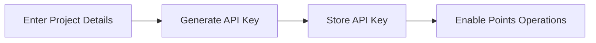
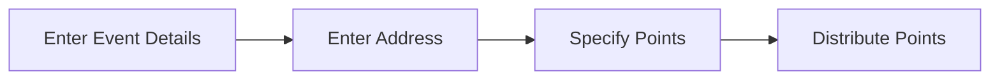
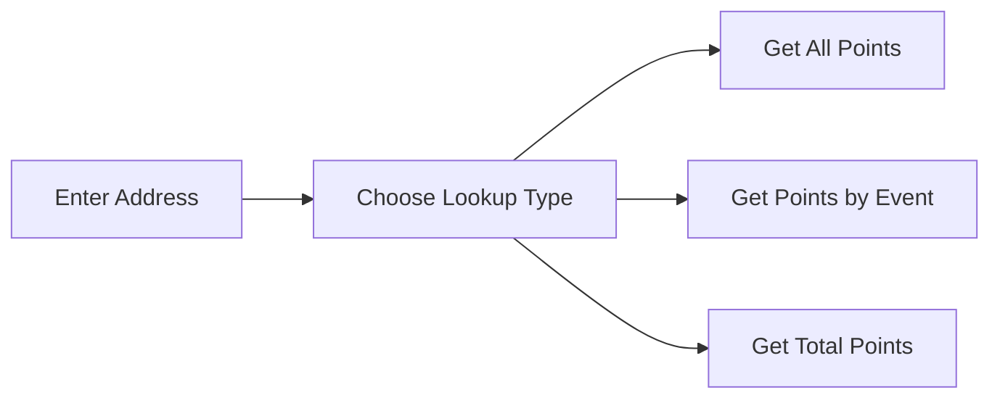

# Points Distribution System

A full-stack web application for managing and distributing points to addresses, built with React, TypeScript, and the Points Distribution SDK.


## 🌟 Features

- **API Key Management**: Secure generation and storage of API keys
- **Points Distribution**: Distribute points to blockchain addresses
- **Points Lookup**: Multiple ways to query points data
- **Real-time Feedback**: Instant notifications for all operations
- **Responsive Design**: Works seamlessly on desktop and mobile devices

## 🛠️ Tech Stack

- **Frontend**: React with TypeScript
- **Styling**: Tailwind CSS
- **State Management**: React Hooks
- **Notifications**: react-hot-toast
- **SDK**: points-distribution-sdk

## 📦 Installation

1. Clone the repository:
```bash
git clone https://github.com/yourusername/points-distribution-system.git
cd points-distribution-system
```

2. Install dependencies:
```bash
npm install
```

3. Install the Points Distribution SDK:
```bash
npm install points-distribution-sdk
```

## 🚀 Usage

1. Start the development server:
```bash
npm run dev
```

2. Open your browser and navigate to `http://localhost:3000`

## 🔄 System Flow

### 1. API Key Generation


### 2. Points Distribution


### 3. Points Lookup


## 💻 Component Structure

```
points-distribution-system/
├── components/
│   ├── ApiKeyForm.tsx
│   ├── DistributePointsForm.tsx
│   └── PointsLookup.tsx
├── pages/
│   └── index.tsx
└── ...
```

## 🔍 Component Details

### ApiKeyForm
- Handles API key generation
- Stores API key in localStorage
- Provides copy-to-clipboard functionality

### DistributePointsForm
- Manages point distribution to addresses
- Validates input data
- Provides real-time feedback

### PointsLookup
- Multiple lookup options:
  - All points for an address
  - Points for specific event
  - Total points calculation
- Displays results in formatted JSON

## 🔐 SDK Integration

The system uses the Points Distribution SDK for all operations:

```typescript
import { PointsSDK } from 'points-distribution-sdk';

// Generate API Key
const registration = await PointsSDK.register('ProjectName', 'email@example.com');

// Initialize SDK
const sdk = new PointsSDK(apiKey);

// Distribute Points
await sdk.distribute('eventName', [
  { address: '0x123...', points: 100 }
]);

// Lookup Points
const points = await sdk.getPointsByAddress('0x123...');
```

## 🌐 API Endpoints

The SDK internally communicates with the following endpoints:

|
 Endpoint 
|
 Method 
|
 Description 
|
|
----------
|
---------
|
-------------
|
|
`/register`
|
 POST 
|
 Generate new API key 
|
|
`/distribute`
|
 POST 
|
 Distribute points 
|
|
`/points/address/:address`
|
 GET 
|
 Get points by address 
|
|
`/points/address/:address/event/:eventName`
|
 GET 
|
 Get points by address and event 
|
|
`/points/address/:address/total`
|
 GET 
|
 Get total points 
|

## 📱 Screenshots

### API Key Generation

### Points Distribution

### Points Lookup

## 🔨 Development

1. Fork the repository
2. Create your feature branch:
```bash
git checkout -b feature/AmazingFeature
```
3. Commit your changes:
```bash
git commit -m 'Add some AmazingFeature'
```
4. Push to the branch:
```bash
git push origin feature/AmazingFeature
```
5. Open a Pull Request
